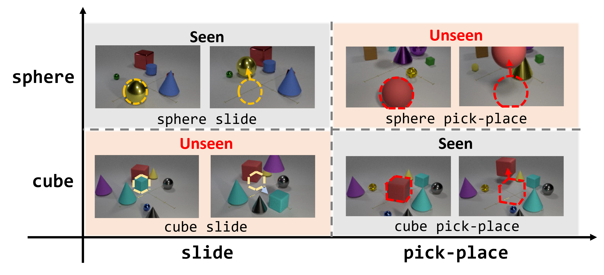

# [ICCV 2025] Zero-Shot Compositional Video Learning with Coding Rate Reduction
This is an official implementation of [Zero-Shot Compositional Video Learning with Coding Rate Reduction](https://openaccess.thecvf.com/content/ICCV2025/papers/Jung_Zero-Shot_Compositional_Video_Learning_with_Coding_Rate_Reduction_ICCV_2025_paper.pdf).
In this work, we propose information-theoretic disentangled representation learning method for the zero-shot compositional generalization problem in video understanding.
This repository contains implementation of the proposed method and training/evaluation scripts for reproducing the results reported in the paper.




## Getting Started
- To prepare the Sth-Com dataset including word embeddings, we refer you to follow the instructions described in the [Sth-Com](https://github.com/RongchangLi/ZSCAR_C2C).
- Most of configurations are managed by **config/base.yaml**, make sure to set appropriate dataset and save directory paths before training.


## Training
```bash
bash script/run_train.sh
```

## Evaluation
```bash
bash script/run_eval.sh
```
Pre-trained checkpoints are available at [this link](https://huggingface.co/heeseokjung/zs-comp-mcr2/tree/main).

## Notes
- For the first few runs, loading the dataset and training might be significantly slow, but it will become much faster in subsequent runs due to OS-level caching. 
- We refactored the codebase to support Distributed Data Parallel (DDP) training for scalability; however, in most cases, single-GPU training showed slightly better performance. All results reported in the paper were obtained using a single GPU setup.
- Numerical instability may occur in the matrix inversion included in the derivatives of coding rate reduction under certain hyperparameter settings.

## Acknowledgements
This repository is built upon [C2C](https://github.com/RongchangLi/ZSCAR_C2C). We sincerely appreciate their efforts in releasing both the codebase and the dataset.


## Citation
If you find this repository useful, please consider citing:
```bibtex
@inproceedings{jung2025zero,
  title={Zero-Shot Compositional Video Learning with Coding Rate Reduction},
  author={Jung, Heeseok and Bak, Jun-Hyeon and Jeong, Yujin and Lee, Gyugeun and Ahn, Jinwoo and Kim, Eun-Sol},
  booktitle={Proceedings of the IEEE/CVF International Conference on Computer Vision},
  pages={20508--20518},
  year={2025}
}
```